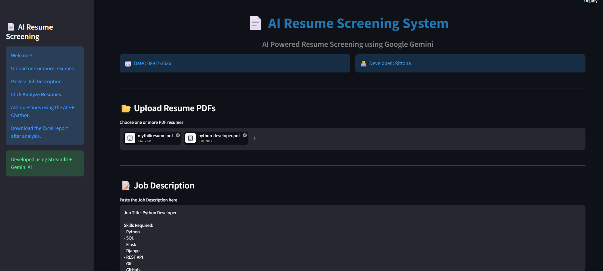
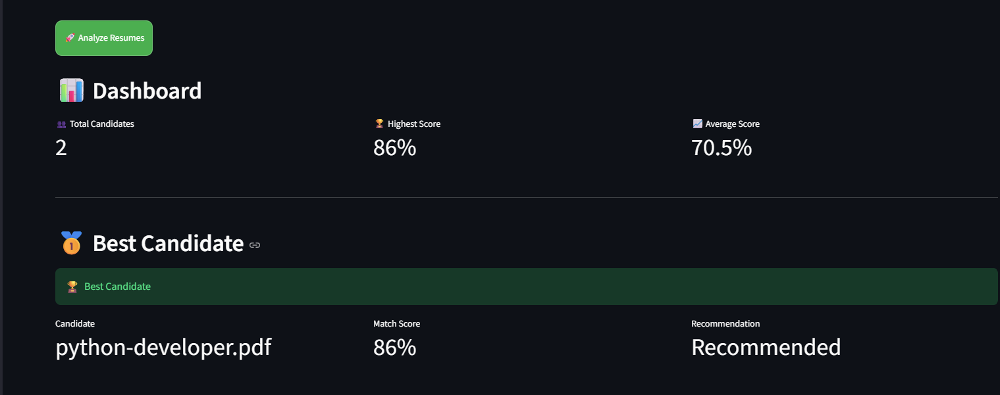
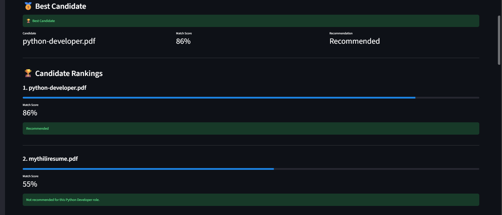
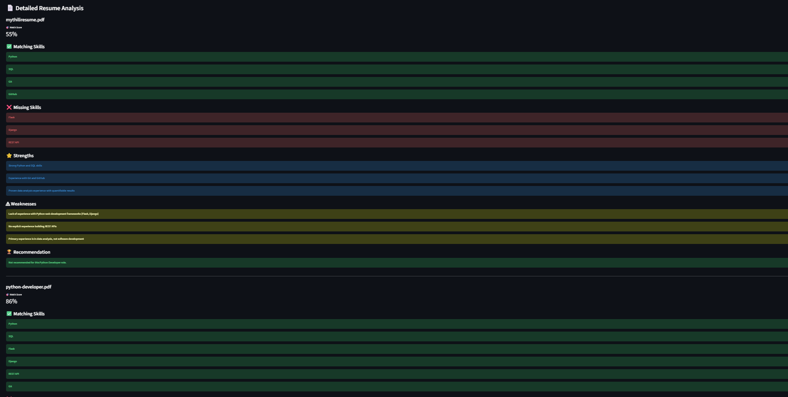
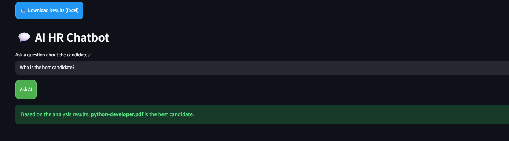

# 📄 AI Resume Screening System

## Overview

The AI Resume Screening System is a Streamlit-based web application that uses Google Gemini AI to analyze resumes against a job description. It helps recruiters quickly identify the best candidates by providing match scores, strengths, weaknesses, missing skills, rankings, and an AI HR chatbot.

---

## Features

- Upload multiple PDF resumes
- Paste any job description
- AI-powered resume analysis
- Match score calculation
- Candidate ranking
- Best candidate selection
- Dashboard with statistics
- Detailed resume analysis
- Download Excel report
- AI HR Chatbot

---

## Technologies Used

- Python
- Streamlit
- Google Gemini AI
- LangChain
- PyMuPDF
- OpenPyXL

---

## Screenshots

### Home Page

### Dashboard

### Candidate Rankings

### Detailed Analysis

### AI HR Chatbot

---

## Author

**Rittona**